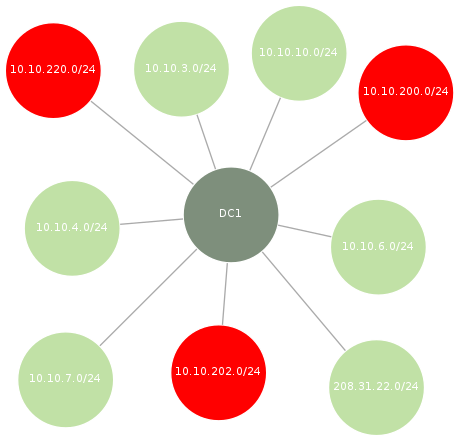

Sleat - Security Logon Event Analysis Tools
===========================================

A collection of scripts for collecting, parsing, and analyzing logon events from Windows Security logs.

These scripts can be used for:
* Identifying workstations belonging to privileged users
* Identifying workstations/accounts connecting from the CDE
* Identifying workstations/accounts connecting from an IP address that wasn't included (or conveniently forgotten!) in the scoping documents
* Visualizing the relationship of logon events across the environment using Graphviz

Before performing analysis, logon events must first be collected from a Windows host. This can be done several ways:
1. Using the included Powershell script, `sleat-collect.ps1`. This script will search the Security log on the local Windows host for Events with EventID 4624, pull specific fields (IP, Domain, Username, Workstation), sort and uniq the results, then write the output to a CSV file.
2. Copying the raw Security log (Security.evtx) off the Windows host and parsing it locally. EVTX files are stored in a proprietary binary XML format, so parsing it requires outside help. A python tool called [python-evtx](https://github.com/williballenthin/python-evtx) works well for converting the binary data into an ASCII XML format. This dump of ASCII XML can then be parsed by `sleat-parse.py` to build a CSV file with the same fields produced by `sleat-collect.ps1`. 

The resultant CSV file is then passed to `sleat-analyze.rb` for analysis, along with two other files:
1. &lt;corp networks&gt; - a newline-delimited text file of networks in corporate scope with CIDR notation (ex: 10.5.1.0/24)
2. &lt;cde networks&gt; - a newline-delimited text file of networks in CDE scope with CIDR notation (ex: 172.16.10.0/24)

The scripts are broken up into 3 parts: Collect, Parse, and Analyze.

Overview of Scripts
-------------------

#### Collect
`sleat-collect.ps1` - Powershell script to enumerate logon events from the Security log

This script should be copied to the target Windows host and executed as a user with Administrator privileges. You may need to Set-ExecutionPolicy -Bypass before running. Pouring through hundreds of thousands of Events can take several minutes (on some hosts, can take upwards of 45 minutes). Although slow, this is less work than copying the Security.evtx file, converting it to ASCII XML, then parsing it.

Example usage:
```
PS C:\Users\Administrator\Desktop> dir


    Directory: C:\Users\Administrator\Desktop


Mode                LastWriteTime     Length Name
----                -------------     ------ ----
-a---         2/11/2016   9:11 PM        527 sleat-collect.ps1


PS C:\Users\Administrator\Desktop> Set-ExecutionPolicy Bypass

Execution Policy Change
The execution policy helps protect you from scripts that you do not trust. Changing the execution policy might expose
you to the security risks described in the about_Execution_Policies help topic at
http://go.microsoft.com/fwlink/?LinkID=135170. Do you want to change the execution policy?
[Y] Yes  [N] No  [S] Suspend  [?] Help (default is "Y"):
PS C:\Users\Administrator\Desktop> .\sleat-collect.ps1
PS C:\Users\Administrator\Desktop> dir


    Directory: C:\Users\Administrator\Desktop


Mode                LastWriteTime     Length Name
----                -------------     ------ ----
-a---         2/11/2016   9:13 PM        243 DC1.csv
-a---         2/11/2016   9:11 PM        527 sleat-collect.ps1


PS C:\Users\Administrator\Desktop> type .\DC1.csv
"IpAddress","TargetDomainName","TargetUserName","WorkstationName"
"-","CORPDOM","DC1$",""
"-","NT AUTHORITY","SYSTEM",""
"::1","CORPDOM","DC1$",""
"10.10.10.10","CORPDOM","DC1$",""
"127.0.0.1","CORPDOM","Administrator","DC1"
"fe80::d144:4b4c:8789:f16d","CORPDOM","DC1$",""
<snipped>
```

#### Parse
`sleat-parse.py` - Python script for parsing output from python-evtx

If sleat-collect.ps1 was used to generate the CSV file, then this step can be skipped.

If the Security.evtx log was copied off the Windows host (usually found at C:\Windows\System32\winevt\Logs\Security.evtx), then the first step in parsing it locally is to convert it from the proprietary binary XML format into an ASCII XML format. This can be done with [python-evtx](https://github.com/williballenthin/python-evtx):
```
root@kali:~# git clone https://github.com/williballenthin/python-evtx.git
Cloning into 'python-evtx'...
remote: Counting objects: 896, done.
remote: Total 896 (delta 0), reused 0 (delta 0), pack-reused 896
Receiving objects: 100% (896/896), 2.69 MiB | 0 bytes/s, done.
Resolving deltas: 100% (469/469), done.
Checking connectivity... done.
root@kali:~# ll
total 336988
drwxr-xr-x 6 root root      4096 Feb  4 12:33 python-evtx
-rw-r--r-- 1 root root 314576896 Feb  4 07:21 Security.evtx
root@kali:~# python python-evtx/scripts/evtxdump.py Security.evtx > CORPDOM-dump.xml
```

Once the data has been converted to ASCII XML, the relevant fields need to be pulled from the Logon events. This can be done by sleat-parse.py:
```
$ python sleat-parse.py -h
Usage: sleat-parse.py INFILE [-o OUTFILE]

An XML parser for output generated by python-evtx. Parses input XML file and pulls fields related to Logon events (EventID 4624).
Sorts and removes duplicates records. By default writes output to 'logons.csv' in current working directory unless -o option is specified.

Output format:
  IpAddress,TargetDomainName,TargetUserName,WorkstationName

Examples:
  sleat-parse.py CORP-dump.xml
  sleat-parse.py CORP-dump.xml -o CORP-logons.csv

Type -h or --help for a full listing of options.

Options:
  -h, --help  show this help message and exit
  -o OUTFILE  Write output to OUTFILE. If this option is not specified, then
              will write output to 'logons.csv' by default in the current
              working directory.
```

Using sleat-parse.py to generate 'CORPDOM-logons.csv' from 'CORPDOM-dump.xml':
```
$ python sleat-parse.py CORPDOM-dump.xml -o CORPDOM-logons.csv
Output file: CORPDOM-logons.csv
```

The resulting CSV file can then be passed to sleat-analyze.rb.

#### Analyze
`sleat-analyze.rb` - Ruby script for validating scope, identifying locations of privileged users, building graphs of logon relationships, and more.
```
$ ruby sleat-analyze.rb -h
Usage: sleat-analyze.rb [options] <logons.csv> <corp networks> <cde networks> 
    logons.csv    - a CSV produced by sleat-collect.ps1 or sleat-parse.py
    corp networks - newline-delimited file of networks in corporate scope with CIDR notation (ex: 10.5.1.0/24)
    cde networks  - newline-delimited file of networks in CDE scope with CIDR notation (ex: 172.16.10.0/24)

    Example usage
    -------------
    Show scope and user for all logon events (default):
      sleat-analyze.rb logons.csv corp-vlans.txt cde-vlans.txt

    Filter out all corporate hosts:
      sleat-analyze.rb -c logons.csv corp-vlans.txt cde-vlans.txt

    Filter out all machine accounts and exclude domain\user from output:
      sleat-analyze.rb -mu logons.csv corp-vlans.txt cde-vlans.txt

    Show logons performed by privileged users:
      sleat-analyze.rb -p privusers.txt logons.csv corp-vlans.txt cde-vlans.txt

    Show logons performed by privileged users only from the CDE:
      sleat-analyze.rb -cnp privusers.txt logons.csv corp-vlans.txt cde-vlans.txt

    -p privUsersFile                 File containing newline-delimited list of privileged users. Will only show results for privileged users.
    -u                               Filter out domain\username from output
    -m                               Filter out machine accounts (ex: WIN7-BOB$)
    -n                               Filter out hosts not in scope
    -c                               Filter out hosts in corp
    -d                               Filter out hosts in CDE
    -h, --help                       Displays help
```

By default, the script shows a fully verbose dump:
```
$ ruby sleat-analyze.rb CORPDOM-logons.csv corp-vlans.txt cde-vlans.txt
Corp: 10.10.10.130 - CORPDOM\ORSK01$
Corp: 10.10.10.131 - CORPDOM\ORSK02$
Corp: 10.10.10.132 - CORPDOM\ORSKQ01$
Corp: 10.10.10.139 - CORPDOM\SKLEP01$
Corp: 10.10.10.140 - CORPDOM\LPND01$
Corp: 10.10.10.173 - CORPDOM\ESX01$
Corp: 10.10.10.192 - CORPDOM\PSS2$
Corp: 10.10.10.222 - CORPDOM\EFCT01$
CDE: 10.10.200.153 - CORPDOM\atlfosvc
CDE: 10.10.202.71 - CORPDOM\PBBCDB$
CDE: 10.10.202.73 - CORPDOM\cjones
Out: 10.10.21.16 - CORPDOM\ajones
Out: 10.10.21.17 - CORPDOM\ATL-EYJR$
Out: 10.10.21.17 - CORPDOM\eyjr
Out: 10.10.21.18 - CORPDOM\mgiles
Out: 10.10.21.18 - CORPDOM\ATL-mgiles$
<snipped>
Out: 10.9.66.38 - CORPDOM\gmaddux
Out: 10.9.66.64 - CORPDOM\GWI-AAA$
Out: 10.9.86.15 - CORPDOM\kmillwood
Out: 172.16.0.133 - CORPDOM\MIS-AA$
Corp: 208.31.22.10 - CORPDOM\atlfosvc

Counts:
CDE:          13
Corp:         314
Out of scope: 449

Run: neato -T png -O inscope.dot && neato -T png -O outscope.dot
```

This output can be filtered using various options. For example, filtering out corporate hosts:
```
$ ruby sleat-analyze.rb -c CORPDOM-logons.csv corp-vlans.txt cde-vlans.txt
CDE: 10.10.200.153 - CORPDOM\atlfosvc
CDE: 10.10.202.71 - CORPDOM\PBBCDB$
CDE: 10.10.202.73 - CORPDOM\cjones
Out: 10.10.21.16 - CORPDOM\ajones
Out: 10.10.21.17 - CORPDOM\ATL-EYJR$
Out: 10.10.21.17 - CORPDOM\eyjr
Out: 10.10.21.18 - CORPDOM\mgiles
Out: 10.10.21.18 - CORPDOM\ATL-mgiles$
<snipped>
Out: 10.9.66.38 - CORPDOM\gmaddux
Out: 10.9.66.64 - CORPDOM\GWI-AAA$
Out: 10.9.86.15 - CORPDOM\dfodbmdbv
Out: 172.16.0.133 - CORPDOM\MIS-AA$
Corp: 208.31.22.10 - CORPDOM\atlfosvc

Counts:
CDE:          13
Corp:         0
Out of scope: 449

Run: neato -T png -O inscope.dot && neato -T png -O outscope.dot
```

Filtering out machine accounts and domain\username from output:
```
$ ruby sleat-analyze.rb -mu CORPDOM-logons.csv corp-vlans.txt cde-vlans.txt
CDE: 10.10.200.153
CDE: 10.10.200.153
CDE: 10.10.202.73
Out: 10.10.21.16
Out: 10.10.21.17
Out: 10.10.21.18
Out: 10.10.21.24
Out: 10.10.21.25
Out: 10.10.21.26
Out: 10.10.21.29
Out: 10.10.21.30
Out: 10.10.21.30
<snipped>
Out: 10.9.44.35
Out: 10.9.66.38
Out: 10.9.86.15
Corp: 208.31.22.10

Counts:
CDE:          12
Corp:         166
Out of scope: 290

Run: neato -T png -O inscope.dot && neato -T png -O outscope.dot
```

Instead of finding hosts based on their scope, you may want to find hosts that belong to a privileged user. Let's say a list of privileged users resides in a file named privusers.txt:
```
$ cat privusers.txt
CORPDOM\adback
CORPDOM\a_ffreeman
CORPDOM\a_oalbies
CORPDOM\a_dswanson
CORPDOM\a_ariley
CORPDOM\a_msmith
CORPDOM\a_einciarte
CORPDOM\a_jteheran
```

This file can be passed with the -p option to only show logons for these users (domain names are ignored - this may help find accounts with the same name across different domains):
```
$ ruby sleat-analyze.rb -p privusers.txt CORPDOM-logons.csv corp-vlans.txt cde-vlans.txt
Corp: 10.10.6.161 - CORPDOM\a_ffreeman
Corp: 10.10.6.161 - CORPDOM\a_jteheran
Corp: 10.10.6.161 - CORPDOM\a_oalbies
Corp: 10.10.6.161 - CORPDOM\a_msmith
Corp: 10.10.6.43 - CORPDOM\a_ffreeman

Counts:
CDE:          0
Corp:         5
Out of scope: 0

Run: neato -T png -O inscope.dot && neato -T png -O outscope.dot
```

Each time the script is ran, two files are generated: inscope.dot and outscope.dot. The reminder at the end of the output shows an example of how to render these dot files into a visual graph using neato. The contents of the dot files will only contain the results from the latest sleat-analyze.rb output.

Example output of inscope.dot.png. Red nodes indicate CDE networks, light green nodes indicate corporate networks:



Background
----------
An attempt to automate the foraging process in Windows Security logs, especially when it comes to privileged user hunting, scope validation, or when the name of a privileged user is unknown. This framework could be extended to process other types of Windows Events.

TODO
----
* Currently only supports analyzing a single CSV. Extend it to analyze multiple CSVs, correlate, and build dot files showing mesh network of logons.
* Filter duplicates when using -u option in sleat-analyze.rb
* Add filter to match (or exclude) specified domain names
* Multithread powershell script to collect logs from multiple hosts simultaneously and write back to an open share (Routehunter-style)
* Investigate other types of useful Events to analyze (currently just inspecting 4624)
